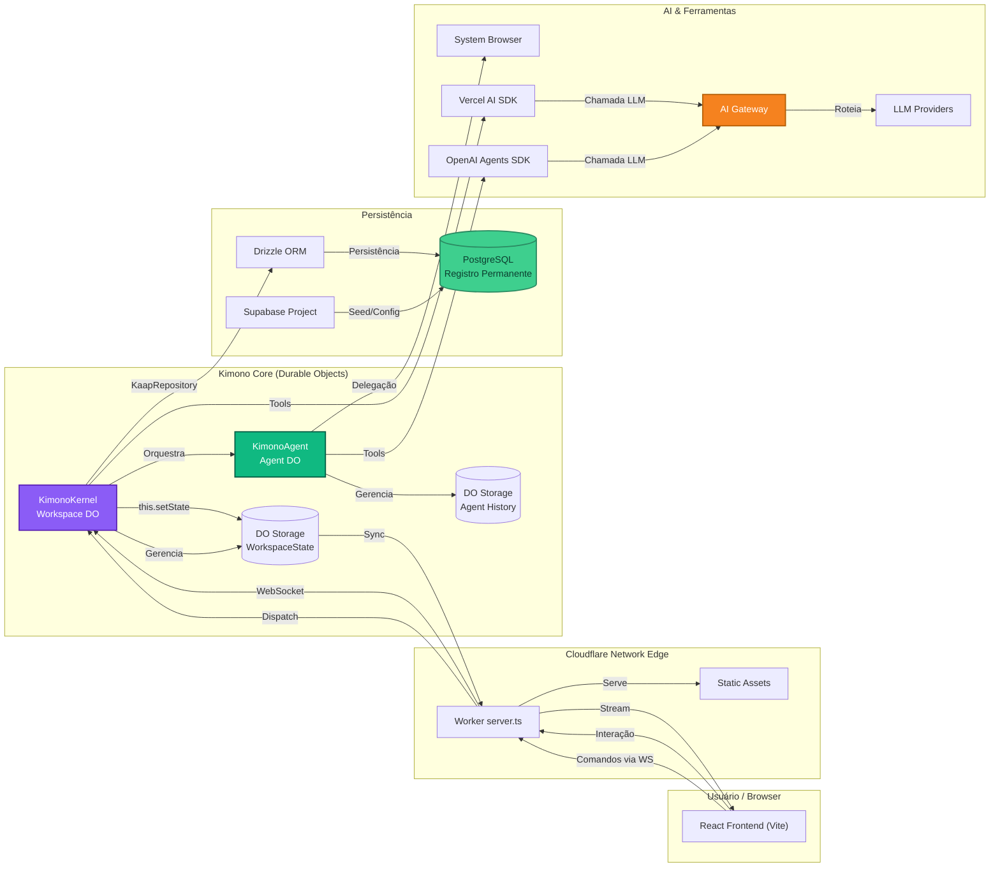

<div align="center">
<h1 align="center">Kimono AI 👘</h1>
<p align="center">
Kimono AI: inteligência autônoma da LLM impulsionando agentes inteligentes e transparentes.
<br />
<a href="https://app.usekimono.ai"><strong>Visite o Projeto »</strong></a>
<br />
<br />

<div align="center">
  
  
  
  
  
</div>
<div align="center" style="margin-top: 8px;">
  
  
  
  
  
</div>

---

## A Filosofia Kimono

O desenvolvimento do Kimono é guiado por princípios inegociáveis que definem nossa abordagem arquitetural.

**1. Lógica Emerge da LLM, Não do Código**: A lógica de negócio dinâmica deve emergir da LLM. Perguntamos sempre: "Qual ferramenta, prompt ou estrutura de dados empodera melhor a LLM?"
**2. Projete Sistemas, Não Soluções**: Cada entrega é uma peça composable que a LLM pode recombinar para resolver classes inteiras de problemas.
**3. Experiência ***"Glass Box"*** é Arquitetura**: Backend e UI são faces do mesmo sistema. Cada decisão deve resultar em um feed de raciocínio transparente.
**4. Memória é Fundamento:** Separa-se Memória de Trabalho (Durable Object state) do **Registro Permanente** (Postgres) para equilibrar velocidade e consistência.
**5. Fluxo é Guia, Não Grade:** `flow_definition` orienta a LLM como mapa estratégico; ela pode desviar para cumprir objetivos.

---

## Visão Geral da Arquitetura
---
A plataforma segue o padrão de Fonte Única da Verdade: PostgreSQL → estado do Durable Object (`this.setState`) → WebSocket → Frontend (read-only). Comandos sobem sempre pela conexão WebSocket para o `KimonoKernel`.



- **`KimonoKernel` (Durable Object):** O sistema operacional por workspace. Carrega definições do Postgres, roteia intenções, aplica validações e publica o `WorkspaceState` via `this.setState`.
- **`KimonoAgent` (Durable Object):** Estende `Agent` do Cloudflare Agents SDK. Mantém memória transitória (SQLite), executa fluxos (`flow_definition`) e chama ferramentas/LLMs.
- **KAAP (`Kimono Agent Application Protocol`):** Especificações `.json` que descrevem agentes (metadados, prompts, toolbelt, permissões e fluxos).
- **Memória:** Trabalho (Durable Objects + SQLite) para respostas imediatas; Registro Permanente (Postgres via Drizzle) como fonte canônica.

## Stack Tecnológico

- **Backend:** Cloudflare Workers & Durable Objects, Hono, Cloudflare Agents SDK (orquestração de agentes).
- **Frontend:** Frontend	React (Vite), TailwindCSS, ReactFlow, HeroUI.
- **AI & Ferramentas:**	OpenAI Agents SDK, Vercel AI SDK, Model Context Protocol, Browser Tools.
- **Dados:** Postgres (Supabase) + Drizzle ORM; SQLite (`better-sqlite3`) dentro dos DOs.
- **Observabilidade & Deploy:** Wrangler, Sentry, AI Gateway, Cloudflare Tail.

## Estrutura do Projeto

```
/
├── backend/
│   └── src/
│       ├── server.ts            # Entrada do Worker
│       ├── core/                # KimonoKernel, processos, roteadores
│       ├── runtime/             # KimonoAgent e executores
│       ├── db/                  # Schema Drizzle + repositórios
│       ├── tools/               # Definições de ferramentas
│       ├── middleware/          # Interceptores Worker/Agents
│       ├── services/            # Serviços auxiliares
│       └── utils/               # Helpers compartilhados
├── frontend/
│   └── src/
│       ├── components/
│       ├── views/
│       ├── context/
│       ├── hooks/
│       ├── services/
│       └── assets/
├── shared/                      # Tipos e utilitários comuns (@shared/*)
├── drizzle/                     # Migrações SQL
├── tests/                       # Vitest (unit + integration)
├── docs/                        # Referências (ex.: agents-cloudflare)
├── scripts/                     # Utilitários (Supabase, ícones)
└── AGENTS.md                    # Guia detalhado de contribuição
```


## Como Executar o Projeto Localmente (Desenvolvimento)

Siga os passos abaixo para configurar e executar o projeto no seu ambiente de desenvolvimento.

### Pré-requisitos

-   [Node.js](https://nodejs.org/en/) (20+).
-   [pnpm](https://pnpm.io/).
-   [Cloudflare Wrangler CLI](https://developers.cloudflare.com/workers/wrangler/install-and-update/) autenticado `wrangler login`.
-   [Supabase CLI](https://supabase.com/docs/guides/local-development?queryGroups=package-manager&package-manager=pnpm).

### Passos

1.  **Clone o repositório:**
    ```bash
    git clone <repo> <nome-da-pasta>
    ```
    
2.  **Acesse o diretório do projeto:**
    ```bash
    cd <nome-da-pasta>
    ```
    
3.  **Instale as dependências:**
    ```bash
    pnpm i
    ```

4.  **Configure as variáveis de ambiente:**
    -   Crie uma cópia do arquivo de exemplo `.dev.vars.example`:
    ```bash
    cp .dev.vars.example .dev.vars
    ```
    
    -   Abra o arquivo `.dev.vars` e substitua os valores das variáveis de ambientes necessárias.
  
    -   Crie o arquivo `.env` com as variáveis de ambiente do Supabase para o UI (Vite).
        ```env
        VITE_SUPABASE_URL="http://127.0.0.1:54321"
        ```

        ```env
        VITE_SUPABASE_ANON_KEY="SUA_CHAVE_ANON_AQUI"
        ```

5.   **Provisionar o Banco de Dados:**
     ```bash
     supabase start
     pnpm db:migrate    # aplica migrações
     pnpm db:setup      # popula dados seed (quando aplicável)
     pnpm db:generate   # opcional, atualiza tipos
     ```

6.  **Inicie o servidor de desenvolvimento:**
    ```bash
    pnpm start
    ```

### Ambiente QA

O ambiente QA usa configurações específicas definidas em `wrangler.jsonc` (env `qa`):
- **URL Frontend:** `https://app-qa.usekimono.ai`
- **Supabase:** Instância dedicada para QA
- **Durable Objects:** Namespaces separados (`kimono-qa`)
- **Hyperdrive:** Conexão dedicada ao banco QA

**Deploy para QA:**
```bash
pnpm run deploy:qa
```

**Configurar banco QA:**
```bash
pnpm db:setup:qa
```

**Monitorar logs QA:**
```bash
pnpm qa-tail
```

### Ambiente de Produção

O ambiente de produção usa configurações específicas definidas em `wrangler.jsonc` (env `production`):
- **URL Frontend:** `https://app.usekimono.ai`
- **Supabase:** Instância de produção
- **Durable Objects:** Namespaces de produção (`kimono-production`)
- **Hyperdrive:** Conexão otimizada ao banco de produção

**Deploy para produção:**
```bash
pnpm run deploy:production
```

**Configurar banco de produção:**
```bash
pnpm db:setup:production
```

**Monitorar logs de produção:**
```bash
pnpm prod-tail
```

**Nota:** Antes de fazer deploy para produção, certifique-se de que todos os testes passaram e o ambiente QA foi validado.

## Scripts Úteis
- `pnpm build`: build completo (frontend + worker) com sourcemaps.
- `pnpm check`: TypeScript + Biome (lint) de todo o projeto.
- `pnpm types`: gera tipos do Wrangler para bindings.
- `pnpm db:reset`: drop + migrate + setup, útil para ambientes limpos.
- `pnpm run deploy:*`: build e deploy + tail automático do ambiente.
